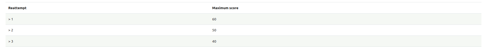
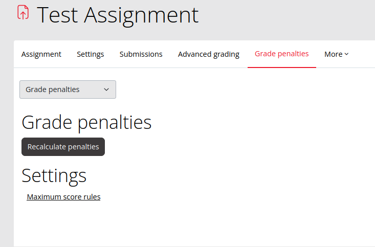
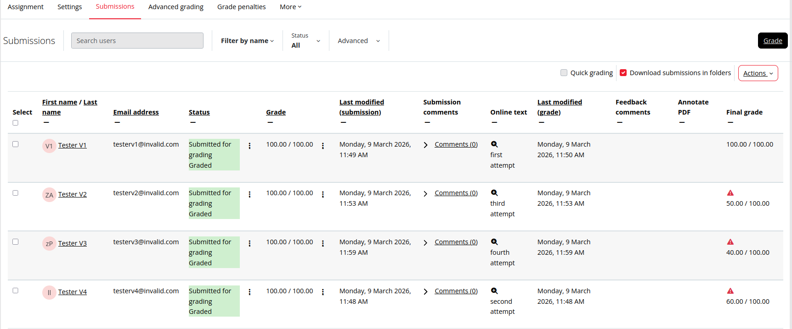

# gradepenalty_reattemptmaxscore Penalty plugin

# Overview

The Reattempt maximum score limit plugin allows course administrators and teachers to apply a configurable maximum grade limit to assignment or quiz activity reattempts in Moodle. This ensures that learners are rewarded for their first attempt while subsequent reattempts are subject to defined grade caps.

Key Features

✅ Configurable Grade Caps: Set maximum achievable scores for each reattempt number (e.g., 1st, 2nd, 3rd attempt, etc.).

⚖️ Automatic Grade Adjustment: If a student’s raw score exceeds the configured maximum for that attempt, it is automatically scaled down.

🔄 Flexible Configuration: The plugin can be applied per activity or globally, depending on instructor's preference.

📊 Fair Assessment Control: Encourages genuine effort in the first attempt while still allowing opportunities for improvement.

# Installation

This plugin requires a changes to the core Penalty API 
apply the patch file in patches/mod_assign.patch and patches/core_grade.patch against your moodle install first.

# Configuration

## Enable the Plugin
Go to: Grades → Grade penalties → Manage penalty plugins
Enable “Reattempt maximum score limit”.

## Define Penalty Rules
Go to: Grades → Grade penalties → Reattempt maximum score → Maximum score rules

Define rules to control the maximum score for reattempts. Each rule applies to a specific reattempt, and the final rule acts as a fallback for any further attempts.

Example:

    Rule 1 → Reattempt: 1, Maximum score: 60
    Final rule → Maximum score: 50

Result:

    First reattempt is capped at 60
    Second and subsequent reattempts are capped at 50

If only one rule is configured, it will apply to all reattempts.

## Select Supported Modules

Go to: Grades → Grade penalties → Supported modules
Select the modules where the rule should apply (e.g., Assignment).

## Configure the Assignment Settings

Within the Assignment activity settings, ensure the following:

Grade type: Point

Allowed attempts: Unlimited

Grade penalties: Yes (enable this to apply the 'reattempt maximum score limit' rule)

# Compatibility

Moodle Version: 5.0 and above
Supported Activities: Assignment 

# Pending

## gradepenalty_reattemptmaxscore
✅ Create PHPUnit tests for automated validation.

🐛 Debug why the plugin does not enable correctly when combined with other grading methods (e.g., rubrics) if Moodle debugging mode is turned on.

## mod_assign
🧪 Add assignment-specific tests for gradepenalty_reattemptmaxscore.

⚙️ Implement functionality to allow multiple penalty plugins to coexist, enabling different assignments to use different penalty types.
Example:

Assignment 1 → uses Due Date Penalty
Assignment 2 → uses Reattempt Max Score Penalty

## mod_quiz
Add support for the Quiz activity module to apply the same reattempt max score penalty logic.
